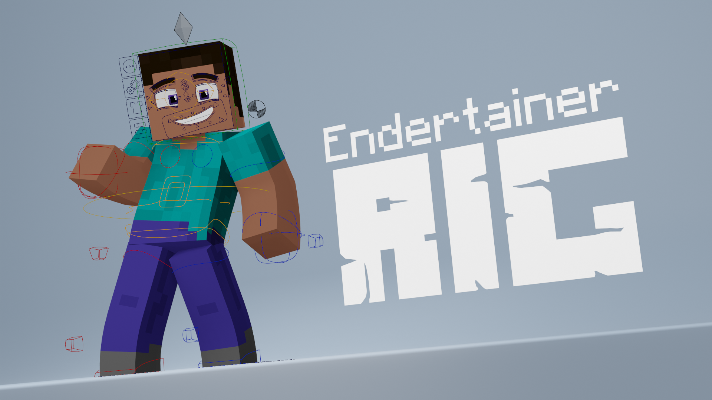

# Endertainer Rig  

## Introduction
 This is a repository for the release version of the Endertainer Rig.

 Endertainer Rig is a free and open-source Minecraft character rig under the CC-BY-4.0 license. This rig is the result of one and a half years of experimenting with making custom rig edits and is the successor of the SB/SS EndEdit project.

Some of the features of the rig include:

- IK-FK Switch & Snapping mechanism
- 3 different Arm types (Steve, Alex, and Slim)
- Finger Rig
- Wrist, Ankles, & Foot Roll
- Advanced Face Editor
- Lattice Deformer
- Rig UI

This rig is licensed under the CC-BY-4.0 license. This license allows you to distribute, remix, adapt, and build upon your work, even commercially, as long as you credit me for the original creation.

## Support and Help
To get started with the rig, check the [Wiki](https://endertainer007.gitbook.io/endertainer-rig-wiki/main/home). And if you need help, you can join my [Discord](https://discord.com/invite/vANwCrPPBu) server.